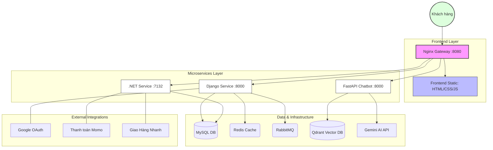

# Veggie - Hệ Thống Quản Lý & Bán Hàng Rau Củ Sạch

Dự án thực tập tốt nghiệp: Xây dựng hệ thống thương mại điện tử bán rau củ sạch tích hợp Chatbot tư vấn thông minh (RAG).

## Kiến Trúc Hệ Thống (Microservices)

Dự án được xây dựng dựa trên kiến trúc microservices, sử dụng Docker để đóng gói và quản lý các dịch vụ:

| Dịch vụ | Công nghệ | Vai trò |
| :--- | :--- | :--- |
| **Frontend** | HTML, CSS, JS | Giao diện người dùng (được phục vụ bởi Nginx) |
| **Django Service** | Python (Django) | Quản lý User, Authentication (Google OAuth), Admin Dashboard, Real-time (Websocket) |
| **.NET Service** | C# (ASP.NET Core) | Xử lý nghiệp vụ chính: Sản phẩm, Giỏ hàng, Thanh toán (Momo), Giao hàng (GHN) |
| **Chatbot API** | Python (FastAPI) | Hệ thống RAG (Retrieval-Augmented Generation) hỗ trợ tư vấn khách hàng |
| **Nginx** | Nginx | API Gateway, điều hướng request và phục vụ Frontend |
| **Database** | MySQL 8.0 | Lưu trữ dữ liệu chính của hệ thống |
| **Vector DB** | Qdrant | Lưu trữ vector phục vụ tìm kiếm ngữ nghĩa cho Chatbot |
| **Caching/Queue** | Redis & RabbitMQ | Quản lý cache và hàng đợi thông báo cho Django |


### Sơ đồ kiến trúc




## Hướng Dẫn Cài Đặt

### Yêu cầu hệ thống
- Đã cài đặt **Docker** và **Docker Compose**.
- Cấu hình file `.env` cho các dịch vụ (Django, Chatbot).

### Các bước thực hiện
1. **Clone repository:**
   ```bash
   git clone <url-cua-ban>
   cd ThucTapTotNghiep
   ```

2. **Khởi chạy hệ thống bằng Docker Compose:**
   ```bash
   docker-compose up --build
   ```

3. **Truy cập ứng dụng:**
   - **Frontend:** [http://localhost:8080](http://localhost:8080)
   - **Django Admin:** [http://localhost:8080/admin](http://localhost:8080/admin)
   - **Swagger (.NET):** [http://localhost:8080/swagger](http://localhost:8080/swagger)

## 📂 Cấu Trúc Thư Mục
```text
.
├── chatbot/             # FastAPI Service (RAG Chatbot)
├── django_service/      # Django Service (Auth, Admin, WebSocket)
├── dotnet_service/      # .NET Core Service (Product, Cart, Payment)
├── frontend/            # Giao diện người dùng (HTML/CSS/JS)
├── nginx/               # Cấu hình Nginx Gateway
└── docker-compose.yml   # Cấu hình orchestration cho toàn bộ hệ thống
```

## ✨ Tính Năng Chính
- **Mua sắm:** Xem sản phẩm, phân loại, giỏ hàng, thanh toán Momo.
- **Vận chuyển:** Tích hợp API Giao Hàng Nhanh (GHN).
- **Tư vấn thông minh:** Chatbot hỗ trợ giải đáp thắc mắc về sản phẩm dựa trên dữ liệu có sẵn (RAG).
- **Quản lý:** Dashboard Admin (Django) để quản lý đơn hàng, người dùng.
- **Đăng nhập:** Hỗ trợ đăng nhập bằng Google.

---
